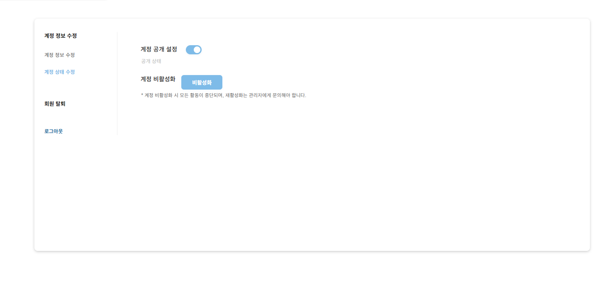
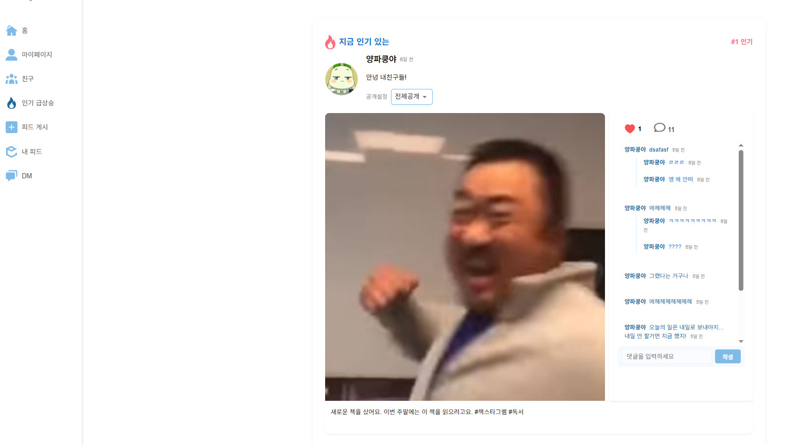
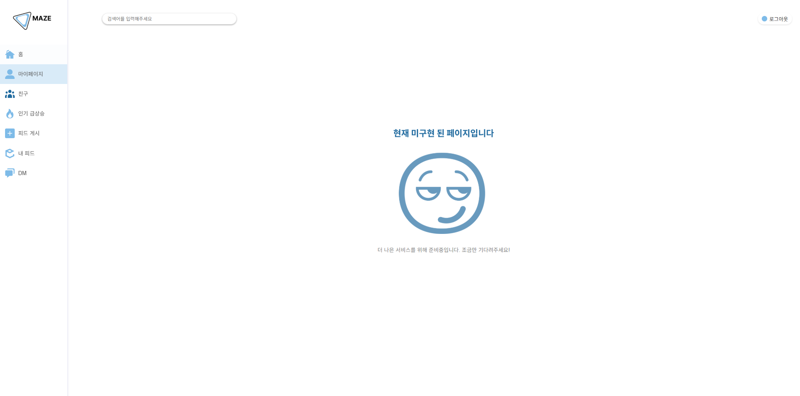

# 🧩 Maze SNS 프로젝트

## ✔ 개발 기간
📅 **2025.05.06 ~ 2025.05.15**

---

## ⭐ 개발 환경 및 사용 도구

- 💻 **개발 툴**: Visual Studio Code, HeidiSQL  
- 💬 **사용 언어**:
  - JavaScript (React)
  - Node.js (Express)
  - MySQL
  - CSS / HTML

---
    
 
⭐ 화면 및 기능 설명
## ⭐ 화면 및 기능 설명

### 🔐 로그인 화면
사용자가 이메일과 비밀번호로 로그인할 수 있는 페이지입니다.  

---

### 🏠 메인 페이지
전체 피드와 친구들의 게시글을 확인할 수 있는 공간입니다.  

---

### 👤 마이페이지
내 정보와 나의 활동을 관리할 수 있는 공간입니다.  
- 기본 정보 조회  
- 내 피드 및 설정 기능  
  

---

### 🔥 인기 게시글
좋아요 수가 높은 인기 게시글 목록을 보여주는 공간입니다.  

---

### 🤝 친구
친구 목록과 친구 요청을 확인할 수 있습니다.  

---

### 🧵 내 피드
내가 작성한 글만 모아 볼 수 있는 개인 피드 공간입니다.  

---

### ✍ 글 작성
텍스트와 이미지를 포함한 새로운 게시글을 작성할 수 있는 페이지입니다.  

